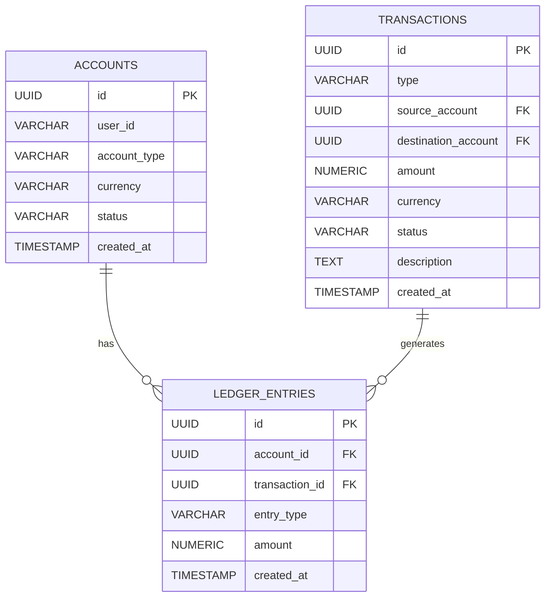

# Financial Ledger System

A fully functional REST API that implements a double-entry ledger system with ACID-compliant transactions, concurrency safety, and strict balance integrity.

---

## Features

- Account creation
- Deposits
- Withdrawals
- Transfers
- Double-entry bookkeeping
- ACID-compliant database transactions
- Concurrency-safe withdrawals and transfers
- Immutable ledger entries 
- On-demand balance calculation
- Transaction descriptions support

---

## Tech Stack

- Node.js
- Express.js
- PostgreSQL
- pg (node-postgres)

---

## Project Structure

```
financial-ledger/
│
├── src/
│   ├── controllers/
│   ├── services/
│   ├── routes/
│   ├── db.js
│   └── app.js
│
├── package.json
└── README.md
```
---

## Setup Instructions

### 1. Clone Repository
```bash
git clone https://github.com/YOUR_USERNAME/financial-ledger-system.git
cd financial-ledger-system
```
### 2. Install Dependencies
```bash
npm install
```
### 3. Setup PostgreSQL Database
Create database:
```SQL
CREATE DATABASE ledger_db;
```
Connect to it:
```SQL
\c ledger_db
```
### 4. Create Tables

Run the following SQL:
```SQL
CREATE TABLE accounts (
  id UUID PRIMARY KEY DEFAULT gen_random_uuid(),
  user_id VARCHAR(100) NOT NULL,
  account_type VARCHAR(50) NOT NULL,
  currency VARCHAR(10) NOT NULL,
  status VARCHAR(20) DEFAULT 'active',
  created_at TIMESTAMP DEFAULT CURRENT_TIMESTAMP
);

CREATE TABLE transactions (
  id UUID PRIMARY KEY DEFAULT gen_random_uuid(),
  type VARCHAR(50) NOT NULL,
  source_account UUID,
  destination_account UUID,
  amount NUMERIC(18,2) NOT NULL,
  currency VARCHAR(10) NOT NULL,
  status VARCHAR(20) DEFAULT 'pending',
  description TEXT,
  created_at TIMESTAMP DEFAULT CURRENT_TIMESTAMP
);

CREATE TABLE ledger_entries (
  id UUID PRIMARY KEY DEFAULT gen_random_uuid(),
  account_id UUID REFERENCES accounts(id),
  transaction_id UUID REFERENCES transactions(id),
  entry_type VARCHAR(10) CHECK (entry_type IN ('debit','credit')),
  amount NUMERIC(18,2) NOT NULL,
  created_at TIMESTAMP DEFAULT CURRENT_TIMESTAMP
);
```
### 5. Run Server
```bash
npm start
```
Server runs at:
```
http://localhost:3000
```
---

## API Endpoints

### Create Account
```JSON
POST /accounts
```

```JSON
{
  "user_id": "user1",
  "account_type": "savings",
  "currency": "INR"
}
```
### Get Account with Calculated Balance
```
GET /accounts/:id
```
Balance is dynamically calculated from ledger entries.

### Deposit
```
POST /deposits
```
```
{
  "account_id": "ACCOUNT_ID",
  "amount": 500,
  "currency": "INR",
  "description": "Salary credit"
}
```
### Withdraw
```
POST /withdrawals
```
```
{
  "account_id": "ACCOUNT_ID",
  "amount": 200,
  "currency": "INR",
  "description": "ATM withdrawal"
}
```
Returns 422 if insufficient funds.

### Transfer
```
POST /transfers
```
```
{
  "source_account": "ACCOUNT_ID",
  "destination_account": "ACCOUNT_ID",
  "amount": 100,
  "currency": "INR",
  "description": "Internal transfer"
}
```
Creates:
- 1 debit entry
- 1 credit entry

### Ledger History
```
GET /accounts/:id/ledger
```
Returns chronological ledger entries.

----

## Design Decisions

### Double-Entry Bookkeeping

Every transfer generates:
- Debit entry (source account)
- Credit entry (destination account)

Verified using:
```sql
SELECT * FROM ledger_entries WHERE transaction_id = 'TRANSACTION_ID';
```
### ACID Compliance
Each financial operation uses:
```
BEGIN
COMMIT
ROLLBACK
```
If any step fails:
- Entire transaction rolls back
- No partial ledger entries are created

### Concurrency Safety
Withdrawals and transfers lock account rows:
```SQL
SELECT * FROM accounts WHERE id = $1 FOR UPDATE;
```
Prevents race conditions and double spending.

### Balance Integrity
Balance is NEVER stored.
It is calculated dynamically:
```SQL
SELECT COALESCE(SUM(
  CASE
    WHEN entry_type = 'credit' THEN amount
    WHEN entry_type = 'debit' THEN -amount
  END
), 0)
FROM ledger_entries
WHERE account_id = 'ACCOUNT_ID';
```
### Immutability
Ledger entries:
- Are append-only
- Are never updated
- Are never deleted
- Audit trail is permanent.

---

## How Evaluator Can Verify

### 1. Verify Double Entry
Make a transfer and run:
```SQL
SELECT * FROM ledger_entries
WHERE transaction_id = 'TRANSFER_ID';
```
Should return exactly 2 entries:
- 1 debit
- 1 credit

### 2. Verify Negative Balance Prevention

Attempt:
```json
{
  "account_id": "ACCOUNT_ID",
  "amount": 999999,
  "currency": "INR"
}
```
Should return:
```
422 Unprocessable Entity
```
### 3. Verify Balance Calculation
Run:
```SQL
SELECT * FROM ledger_entries
WHERE account_id = 'ACCOUNT_ID';
```
Manually sum credits - debits.
Compare with:
```
GET /accounts/:id
```
They must match.

### 4️. Verify Concurrency Protection
Open two Postman requests simultaneously withdrawing same funds.

Only one should succeed.

## ER Diagram (Logical)


---
